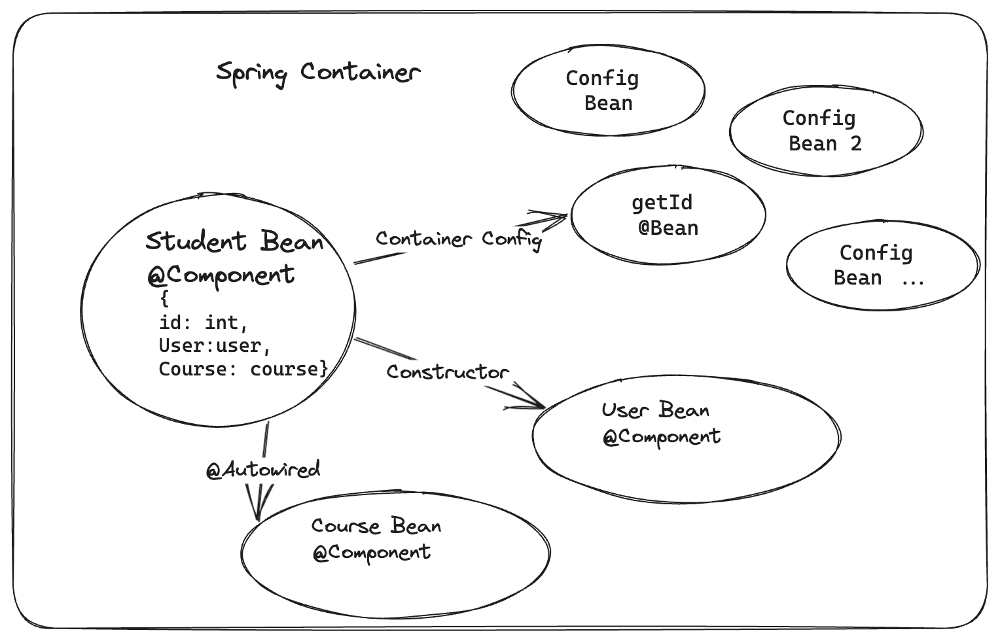

# Spring| Bean | Component | Autowired

This is a simple Spring Boot project designed to explain and demonstrate how beans, components, and @Autowired work within the Spring container. Inside this project, you will discover the beans generated in the container each time we launch our Spring application. We also create four beans using @Component and @Bean methods, as illustrated in the logic graph below.

## Table of Contents

- [Project Information](#project-information)
- [References](#references)

## Project Information
- **Spring Boot Version**: 3.1.4
- **Java Version**: 17
- **Maven**:4.0.0

## References
- [Spring ultimate basics: What are Spring Beans and what is the Spring Container?] (https://www.youtube.com/watch?v=aS9SQITRocc)
- [Spring | Autowire | Dependency Injection | Spring Boot] (https://www.youtube.com/watch?v=K43qyHJXmWI)

